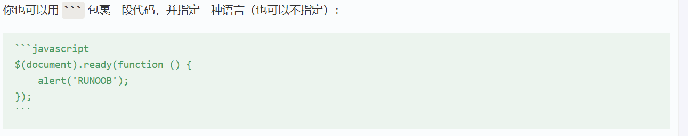

## 代码块  


单个字符用代码块样式可以:`Hello`
如果要表示的代码包含`Hello`字样，则可以使用 ``H`Hello`o``
代码块可以用下面两种样式

```javascript
$(document).ready(function () 
{
    alert('RUNOOB');
});
```

	dddddd
	jdjdjd
	jsdsjfj

代码块：  




## 链接  

### 普通链接  

[链接名称](链接地址)
<www.baidu.com>直接填地址即可


格式：  

