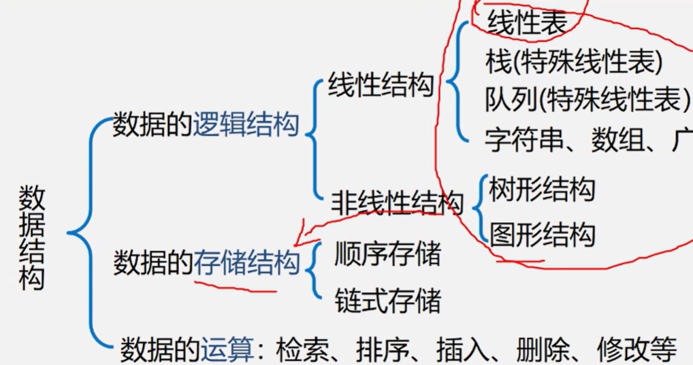
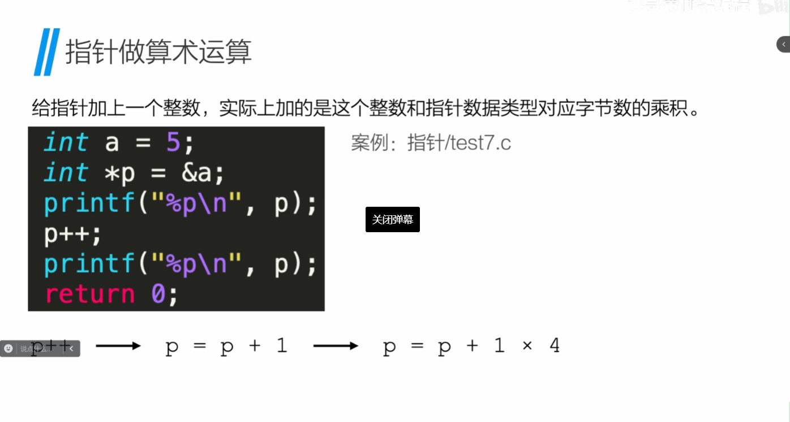
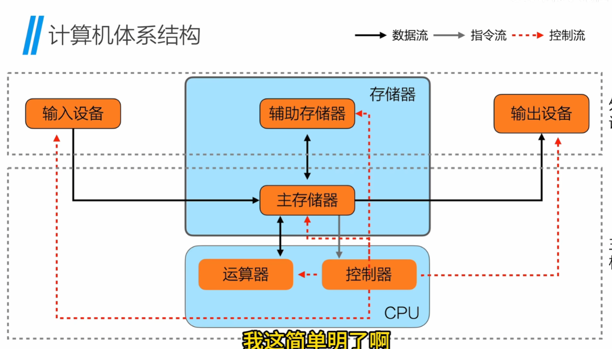
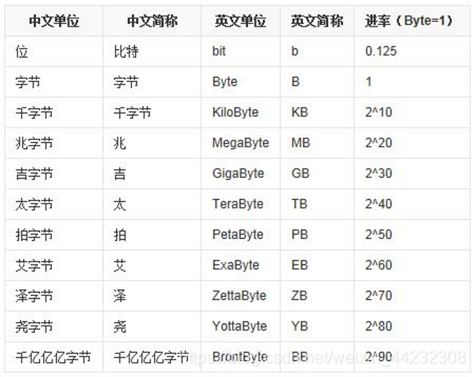
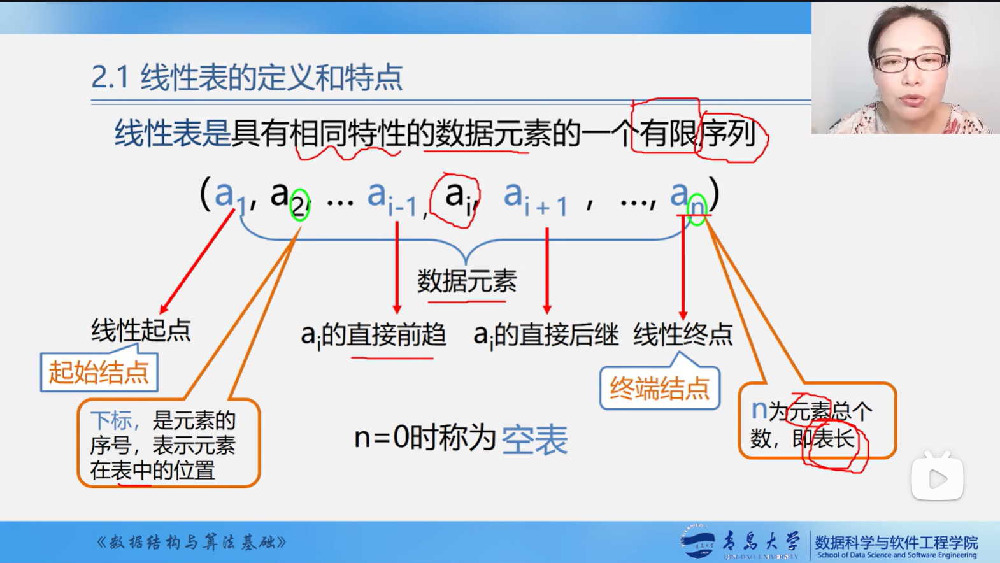
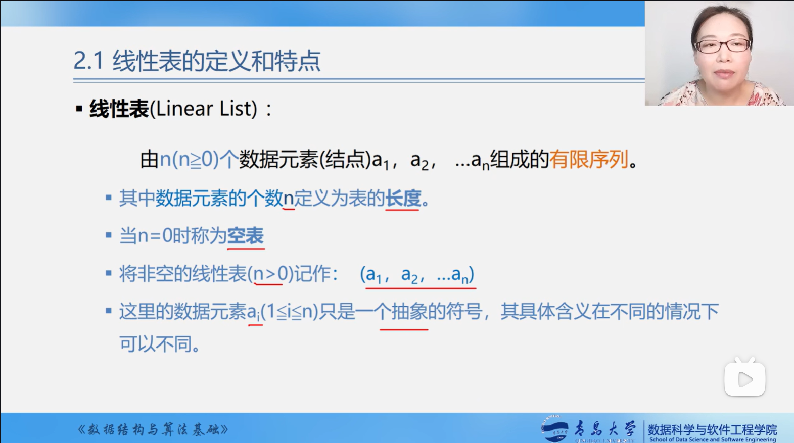

# 数据结构

## 数据结构的定义

> 数据：生活中的各种信息
>
> 结构：数据的组织形式（排列形式）
1. 数据结构的本质​​
  就像整理衣柜时，有人按季节分类（夏天衣服和冬天衣服分开），有人按颜色排列（所有白色衣服放一起）。数据结构就是计算机用来高效整理数据的“分类规则”。它决定了数据如何摆放、如何快速找到，比如数组像一排固定大小的储物柜，每个位置只能放一件物品；而链表则像用绳子串起来的快递盒，每个盒子都能灵活调整位置。

2. 两大核心维度​​
  ​​逻辑结构​​（数据关系）
  分为四大类：
  ​​集合​​：像超市里随意堆放的促销商品，彼此之间没有关联
  ​​线性结构​​：像排队结账的人群，每个人只和前后的顾客有关（如数组、购物清单）
  ​​树形结构​​：像公司的组织架构图，CEO下分多个部门，每个部门又有小组（如文件夹层级）
  ​​图形结构​​：像地铁线路图，每个站点都可能通向多个方向（如社交网络好友关系）
  ​​存储结构​​（物理存放方式）
  ​​顺序存储​​：像电影院对号入座，通过位置编号直接找到座位（如数组）
  ​​链式存储​​：像寻宝游戏，每个线索纸条都写着下一个纸条的位置（如链表）

3. 生活中的常见案例​​
  ​​数组​​：快递柜的格子间，每个格子有固定编号且容量相同
  ​​链表​​：火车车厢，每节车厢自带连接下一节车厢的挂钩
  ​​栈​​：叠放的盘子，最后放上去的盘子最先被拿走（后进先出）
  ​​队列​​：奶茶店排队，先点单的人先拿到饮料（先进先出）
  ​​树结构​​：家谱图，从曾祖父分支到祖父，再分到父亲和叔叔
  ​​图结构​​：导航地图，每个路口都可能通向多条道路


## 数据结构分类：线性表与非线性表
  数据结构按逻辑关系可分为**线性表**和**非线性表**两大类。以下是详细分类及核心特点：



  ### **一、线性表（Linear List）**

  线性表中的数据元素之间存在**一对一**的逻辑关系，呈现严格的顺序性。所有元素首尾相接（除首尾元素外），操作受限于顺序或链式存储方式。

  **1. 一般线性表**

  - **数组（Array）**
    特点：连续存储，通过下标直接访问元素，查询效率高（O(1)），但插入/删除需移动元素（O(n)）

    应用场景：静态数据存储，如固定长度的数列或矩阵。

  - **链表（Linked List）**
    特点：非连续存储，通过指针串联节点，插入/删除高效（O(1)），但查询需遍历（O(n)）

    类型：单链表、双向链表、循环链表

  **2. 受限线性表**

  - **栈（Stack）**
    特点：后进先出（LIFO），仅允许在栈顶操作（入栈、出栈）

    应用：函数调用栈、表达式求值

  - **队列（Queue）**
    特点：先进先出（FIFO），一端插入（队尾），另一端删除（队头）

    类型：普通队列、循环队列、双端队列（Deque）

------

  #### **二、非线性表（Non-linear List）**

  数据元素之间存在**多对多**的逻辑关系，结构更复杂，适合描述层次或网状关系。

  **1. 树形结构（Tree）**

  - **二叉树**
    特点：每个节点最多两个子节点，支持高效查找（O(log n)）。类型包括二叉搜索树、平衡二叉树（AVL）、红黑树

    应用：数据库索引、文件系统目录结构。

  - **堆（Heap）**
    特点：完全二叉树，根节点为最大/最小值，用于优先队列、堆排序

  **2. 图形结构（Graph）**

  * **图（Graph）**

    特点：顶点与边构成的网状结构，可表示复杂关系（如社交网络、交通路线）

    存储方式：邻接矩阵、邻接表

  **3. 散列表（Hash Table）**
    特点：通过哈希函数将键映射到存储位置，实现快速查找（平均O(1)），需处理哈希冲突

  **4. 广义表（Generalized List）**
    特点：允许元素本身是子表，支持递归结构，用于多维数据表示

------

  #### **三、核心对比**

  | **特性** |       **线性表**       |           **非线性表**           |
  | :------: | :--------------------: | :------------------------------: |
  | 元素关系 |         一对一         | 多对多（树：一对多；图：多对多） |
  | 典型结构 |  数组、链表、栈、队列  |        树、图、堆、散列表        |
  | 查询效率 |   数组O(1)，链表O(n)   |        树O(log n)，图O(n)        |
  | 增删效率 |   数组O(n)，链表O(1)   |   树O(log n)，图O(1)（邻接表）   |
  | 应用场景 | 顺序操作、简单数据集合 | 层次关系、复杂网络、动态数据管理 |

------

  **总结**：

  - **线性表**适合需要严格顺序且操作简单的场景，如数组存储静态数据、链表处理动态插入删除。

  - 非线性表

    更适合表达复杂关系，如树形结构用于分层管理（如文件系统），图形结构描述网络拓扑


## 复习（前置知识）

### 函数（对内隐藏细节，对外暴露接口【封装】）

**注意是否有返回值和是否需要传参**

* 返回值看函数类型（int,Char,double,float）或者是否有return函数
* 传递的参数要放在函数申明括号


### 数组


### 字符串

````c
#include<stdio.h>
int main()
{
    char str[]="HelloWorld";//共占12个字符
    printf("%s",str);
    return 0;
}

#include<stdio.h>
#include<string.h>
int main()
{
    char str[12];//不能用str="HelloWorld",会报错
    strcpy(str,"HelloWorld");
    printf("%s",str);
}
````


###  指针

（指针是一种数据类型，用于存储某种数据类型的地址，并按该种数据类型的长度计算其地址的加减）

#### 指针的使用

 ````c
 int a;
 int *p;//*p作为一个变量，在内存中也有地址,p本身的值也是内存中的地址
 a=5;
 p=&a;
 //&num取地址，返回num的地址
 //*num()在非声明变量处，num为指针变量，返回该指针对应的数值
 //*p为指针变量（地址），&a对变量a取地址，*加在指针变量前表示该指针对应的值，&加在普通变量前表示该变量对应的指针
 ````

#### 两个数据交换（指针）

````c
//错误示例
#include<stdio.h>
void swap(int m,int n)
{
    int temp;
    temp=m;
    m=n;
    n=temp;
    printf("%d %d\n",m,n);
   //return m,n;(C语言函数不能返回多个值，return m,n语法无效)
}
int main()
{
    int a,b;
    scanf("%d %d",&a,&b);
    swap(a,b);
    printf("%d %d\n",a,b);
    return 0;
}
````

````c
#include <stdio.h>
void swap(int *m, int *n)
{
    int temp = *m;
    *m = *n;
    *n = temp;

int main()
{
    int a, b;
    scanf("%d %d", &a, &b);
    swap(&a, &b);//通过指针修改原变量
    printf("%d %d", a, b);
    return 0;
}
````

#### 指针与数组

````c
int a[]={1,2,3,4,5}
int *p;//p表示指针，*p表示p的指针对应的数据
p=&a;//此时p指针存储的是a第0个元素的首地址
````

#### 指针的加法

**给指针加上一个整数，实际上加的是这个整数和指针数据类型对应字节数的乘积。**




#### 指针与函数

````
````


### 内存解析

冯诺依曼体系下计算机的基本结构由五大核心部件组成，其核心思想是**存储程序**和**二进制运算**，通过统一存储器实现指令与数据的共享。以下从核心部件、结构特点、数据流动三个方面详细解析：

------

#### 五大核心部件



1. **中央处理器（CPU）**

   - 由运算器和控制器组成
       运算器（ALU）：负责执行算术运算（加减乘除）和逻辑运算（与或非、位移等）
       控制器（CU）：从内存读取指令并译码，生成控制信号协调各部件工作，通过程序计数器（PC）管理指令执行顺序
   - CPU通过
     总线（数据总线、地址总线、控制总线）与内存及其他设备交互
   
2. **存储器（内存）**
   - 存储程序指令和待处理数据，两者以二进制形式共存于同一存储空间。

   - 内存分为RAM（随机读写，断电数据丢失）和ROM（只读，存储启动程序如BIOS）
   - CPU仅直接与内存交互，外设数据需先输入内存再处理
3. **输入设备**
- 将外部数据或指令转换为二进制输入内存，如键盘、鼠标、磁盘等
4. **输出设备**

   - 将处理结果从内存输出，如显示器、打印机、网络接口等

5. **总线系统**

   - 连接各部件的数据传输通道，包括：

     - **数据总线**：传输指令和数据。

     - **地址总线**：指定内存或外设的物理地址。
     - **控制总线**：传递控制信号（如读写、中断）

------

#### 结构特点

1. **存储程序**
   - 程序与数据以二进制形式统一存储于内存，CPU按顺序读取并执行指令
   - 程序可动态修改，实现灵活的任务切换
   
2. **顺序执行与程序控制**

   - 指令默认按内存地址顺序执行，控制器通过分支指令（如条件跳转）改变流程


3. **二进制运算**

   - 所有指令和数据均以二进制表示，简化硬件实现并提高运算可靠性


4. **以内存为中心的数据流**

   - 外设不直接与CPU通信，所有数据需通过内存中转。例如：键盘输入先存入内存，CPU处理后结果再存入内存，最终由显示器输出。


------

#### 数据流动过程

1. 取指阶段：控制器通过地址总线从内存读取指令至指令寄存器（IR）。

2. 译码阶段：控制器解析指令操作码和操作数地址

3. 执行阶段：运算器根据操作码从内存或寄存器获取数据并计算，结果暂存寄存器或写回内存

4. 存储/输出阶段：结果通过总线传输至内存或输出设备


------

#### 局限性及改进

冯诺依曼结构的瓶颈在于**指令与数据共享总线**，导致并行效率受限
。现代计算机通过以下技术优化：
- 
  高速缓存（Cache）：减少CPU访问内存的频率
- 
  流水线技术：并行处理多指令阶段
- 
  改进型哈佛结构：部分分离指令与数据存储（如ARM9）以提升性能

------

#### 总结

冯诺依曼体系通过五大部件的协作实现了通用计算能力，其核心设计（存储程序、二进制、顺序执行）奠定了现代计算机的基础。尽管存在性能瓶颈，但通过技术演进仍广泛应用于通用计算领域。



#### 补充

* `printf("%zu\n",sixeof(n));`sizeof包括`\0`的字节
* `strlen`不包含`\0`的长度


### 结构体

````c
#include<stdio.h>
#include<stdlib.h>
typedef struct
{
    int x;
    int y;
}po;
int main()
{
    po *p;
    p=(po*)malloc(sizeof(po));
    p->x=5;
    p->y=10;
    printf("%d\n",p->x);
    printf("%d\n",p->y);
    return 0;
}
````

#### 结构体的初始化和调用

声明：

````c
struct point
{
	int x;
	int y;
};
````

初始化：``struct``    结构体名 变量名（``struct point p`` ）

调用 ：变量名. 结构体内部变量名=值 （``p.x=10;p.y=15``）

````c
#include<stdio.h>
struct point//声明point的类型数据，相当于struct point为char,int等变量类型
{
    int x;
    int y;
};//结构体定义要以分号结尾
struct point fun(struct point p)//返回值为struct point类型
{
    p.x=2;
    p.y=3;
    return p;
}
int main()
{
    struct point num;
    num.x=10;
    num.y=5;
    printf("%d %d\n",num.x,num.y);
    struct point temp=fun(num);
    printf("%d %d",temp.x,temp.y);
    return 0;
}
````


#### 结构体与指针


## 线性表

### 线性表的定义的特点




