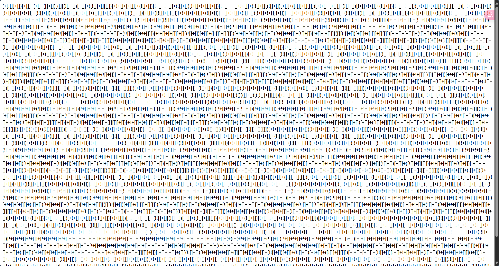

# Hello CTF WEB入门题单

## NSSCTF

题单地址https://www.nssctf.cn/problem/sheet/14392
题解地址https://dqgom7v7dl.feishu.cn/docx/WdHvd735koqwJxxulA2cv4K4nKf
视频教学https://www.bilibili.com/video/BV1sm4y187EK

### [LitCTF 2023\]导弹迷踪 


题目：[[LitCTF 2023\]导弹迷踪 | NSSCTF](https://www.nssctf.cn/problem/3863)
题解：[文章列表 | NSSCTF](https://www.nssctf.cn/note/set/2444)

1.访问源代码中的game.js脚本，发现里面

````java
   FINISH: {
       title: function () {return 'LEVEL COMPLETED';},
       text:  function () {if (mLevel === 6) {return 'GOT F|L|A|G {y0u_w1n_th1s_!!!}';} else {return 'CLICK TO CONTINUE';}},
   }
````
2. 提取方式
**直接提取明文片段**
字符串GOT F|L|A|G {y0u_w1n_th1s_!!!}中的F|L|A|G需合并为FLAG，完整Flag格式为：
``FLAG{y0u_w1n_th1s_!!!}``
**触发条件验证**
需确保游戏逻辑中mLevel变量确实能达到6（代码显示通过mLevel++逐步升级），且在完成第6关时会触发该文本的返回逻辑。

3. 补充说明(代码中的Flag设计采用了两种混淆手法)
   **字符分隔**：通过竖线|分割F/L/A/G，需手动拼接为FLAG
   **伪混淆符号**：使用数字0替代字母o（如y0u）、1替代字母i（如th1s），但实际无需解码即可直接识别:(该Flag定义直接来源于代码中的Messages.FINISH对象（见用户提供的JS代码第40-42行）)

### [LitCTF 2023]1zjs


题目：[[LitCTF 2023\]1zjs | NSSCTF](https://www.nssctf.cn/problem/3871)
题解：

1. 查看网页源代码，发现只有/dist/index.umd.js一个脚本，查看js源代码,发现存在/f@k3f1ag.php文件，里面有一大堆加密后的字符串
   

2. 经查，这是典型的JSfuck加密,利用http://www.hiencode.com/jsfuck.html进行解密，可得``NSSCTF{7[]b8[]d0[]9[]d7[]-3[]e9[]8[]-4[]8[]0[]0[]-a8[]db-2[]9[]be2[]f4[]de9[]a7[]}``

   删去[]即可得flag