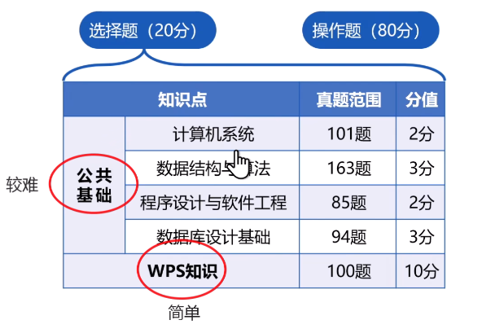

# 相关信息
## 题型及分值分布

### 选择题

### 操作题

* **Word 30分**
* **Excel 30分**
* **PPT 20分**

## 考试时间相关信息

考试时间：3月29日-3月31日

## 网上相关视频资料

* 真题：[（2025年3月）WPS计算机二级真题讲解](https://www.bilibili.com/video/BV1c64y1y7RB/?vd_source=b02ab203ff171eb12a5a14c524c1886c)

* 知识点：[老宋计算机二级WPS Office考点精讲最新免费课程](https://www.bilibili.com/video/BV1Ey4y117iB/?vd_source=b02ab203ff171eb12a5a14c524c1886c)

* 知识点：[计算机二级 放映设置和文件打包-WPS学堂](https://www.wps.cn/learning/course/detail/id/330058?sid=460)

## 十二天速成计划

可用的资料：小黑课堂题库，WPS官方知识点视频，选择题资料 ，一本WPS2019的书

