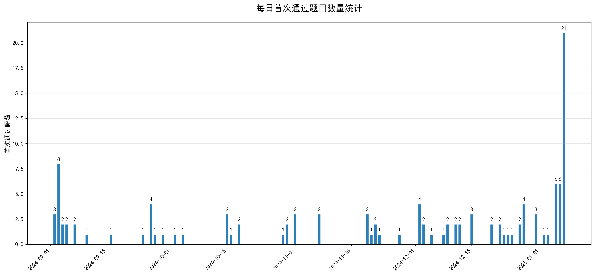

# 作业

## 功能1：提取个人的OJ状态信息

### 刷新令牌获取
````py
import requests
from bs4 import BeautifulSoup

# 获取动态令牌
csrf_url = "https://oj.xtu.edu.cn/csrf.php"
headers = {
    'User-Agent': 'Mozilla/5.0 (Windows NT 10.0; Win64; x64) AppleWebKit/537.36'
}

response = requests.get(csrf_url, headers=headers)
soup = BeautifulSoup(response.text, 'lxml')
print(response.text)
````

刷新令牌：

````
eqSG0SXZx6ooj0Vf4xR9VSjg5G5gKsCP
````

### 模拟登录

````python
import requests
session = requests.Session()
login_url = "https://oj.xtu.edu.cn/login.php"
login_data = {
    'user_id':202405566916,
    'password':202405566916,
    'csrf': "eqSG0SXZx6ooj0Vf4xR9VSjg5G5gKsCP"
}
login_response = session.post(login_url, data=login_data)
````

###  获取数据

````python
import requests
session = requests.Session()
target_url = "https://oj.xtu.edu.cn/status.php?cid=1000&user_id=202405566916"
protected_content = session.get(target_url).text
print(protected_content) 
````

### 数据提取

````python
import csv
from bs4 import BeautifulSoup

html_content = """
<tbody style='font-weight:700' >
....
....
....
....

    </tbody>
"""

# 创建BeautifulSoup对象并指定解析器
soup = BeautifulSoup(html_content, 'lxml')  # 也可以使用'html.parser'

# 定位tbody内的所有tr标签
data = []
for row in soup.select('tbody tr'):
    cols = row.find_all('td')

    # 提取各列数据（按顺序解析）
    submission = {
        '提交ID': cols[0].get_text(strip=True),
        '用户ID': cols[1].a.get_text(strip=True),
        '姓名': cols[2].get_text(strip=True),
        # 检查 <div> 和 <a> 标签是否存在
        '题目编号': cols[3].div.a.get_text(strip=True) if cols[3].div and cols[3].div.a else cols[3].div.get_text(strip=True),
        '判题结果': cols[4].a.get_text(strip=True),
        '内存消耗': cols[5].div.get_text(strip=True),
        '执行时间': cols[6].div.get_text(strip=True),
        '源代码链接': cols[7].a['href'].strip() if cols[7].a else '',
        '代码体积': cols[8].get_text(strip=True),
        '提交时间': cols[9].get_text(strip=True)
    }
    data.append(submission)

    # 输出结构化结果
    for item in data:
        print(item)

        # 可选：转换为Pandas DataFrame
        import pandas as pd
        df = pd.DataFrame(data)
        print("\nDataFrame格式：")
        print(df.head())
        with open('submissions1013.csv', 'w', newline='', encoding='utf-8-sig') as f:
            writer = csv.DictWriter(f, fieldnames=data[0].keys())
            writer.writeheader()
            writer.writerows(data)
            print("数据已保存至当前目录的submissions1013.csv文件")
````

## 数据转换

### 每日完成题数

#### 代码

```` python
import pandas as pd
import matplotlib.pyplot as plt
from matplotlib.dates import DateFormatter

# 设置中文显示（关键！）
plt.rcParams['font.sans-serif'] = ['SimHei']  # 使用黑体显示中文
plt.rcParams['axes.unicode_minus'] = False  # 解决负号显示问题

# 假设处理后的数据存储在 daily_first_accepted.xlsx
df = pd.read_excel('daily_first_accepted.xlsx', parse_dates=['提交日期'])
df = df.sort_values('提交日期')  # 确保日期有序

# 创建画布
plt.figure(figsize=(15, 7), dpi=100)

# 绘制柱状图（核心代码）
bars = plt.bar(
    df['提交日期'], 
    df['首次通过题数'],
    width=0.8,  # 柱宽
    color='#2c7fb8',  # 科技蓝配色
    edgecolor='white',  # 白边增强对比
    linewidth=1.5
)

# 添加数据标签
for bar in bars:
    height = bar.get_height()
    plt.text(bar.get_x() + bar.get_width()/2., 
             height + 0.2,
             f'{height:.0f}',  # 显示整数
             ha='center', va='bottom')

    # 设置坐标轴格式
    # 修改日期格式为年月日
    date_format = DateFormatter("%Y-%m-%d")  
    plt.gca().xaxis.set_major_formatter(date_format)
    plt.xticks(rotation=45, ha='right')  # 45度倾斜日期标签
    plt.ylabel('首次通过题数', fontsize=12)
    plt.grid(axis='y', alpha=0.3)  # 横向网格线

    # 添加图标题
    plt.title('每日首次通过题目数量统计', 
              fontsize=16, pad=20, 
              fontweight='bold')

    # 紧凑布局并保存
    plt.tight_layout()
    plt.savefig('daily_first_accepted_chart.png', dpi=300, bbox_inches='tight')
    plt.show()
````

#### 结果



### 每周完成题数

#### 代码

`````
import pandas as pd
import matplotlib.pyplot as plt

# 设置中文显示
plt.rcParams['font.sans-serif'] = ['SimHei']
plt.rcParams['axes.unicode_minus'] = False

# 读取数据
df = pd.read_excel('daily_first_accepted.xlsx', parse_dates=['提交日期'])
df = df.sort_values('提交日期').set_index('提交日期')

# 过滤日期范围并重新采样
date_range = pd.date_range('2024-09-01', '2025-01-07')  # 明确包含截止日
# 修正此处的语法错误
weekly_data = df.loc[date_range[0]:date_range[-1]]  # 确保包含最后一天
weekly_data = weekly_data.resample('W-MON', closed='left', label='left').sum(min_count=1).reset_index()

# 生成周区间标签（显示完整周期）
weekly_data['周区间'] = [
f"{start.strftime('%Y-%m-%d')}~{end.strftime('%Y-%m-%d')}"
for start, end in zip(
weekly_data['提交日期'] - pd.Timedelta(6, 'D'),  # 周起始日
weekly_data['提交日期']  # 周结束日（周一）
)
]

# 可视化调整
plt.figure(figsize=(15, 7), dpi=100)
bars = plt.bar(weekly_data['周区间'], weekly_data['首次通过题数'], width=0.7, color='#2c7fb8', edgecolor='white')

# 添加数据标签（自动适应短周）
for bar in bars:
height = bar.get_height()
plt.text(bar.get_x() + bar.get_width()/2, height + 0.2, f'{height:.0f}', ha='center', va='bottom', fontsize=9)

# 坐标轴优化
plt.xticks(rotation=45, ha='right')
plt.ylabel('首次通过题数', fontsize=12)
plt.grid(axis='y', alpha=0.3)
plt.title('每周首次通过题目数量统计（2024/09/01-2025/01/07）', fontsize=16, pad=20, fontweight='bold')

plt.tight_layout()
plt.savefig('weekly_first_accepted_chart.png', dpi=300, bbox_inches='tight')
plt.show()
`````

#### 结果


### 每月完成题数

#### 代码

````python
import pandas as pd
import matplotlib.pyplot as plt

# 设置中文显示
plt.rcParams['font.sans-serif'] = ['SimHei']
plt.rcParams['axes.unicode_minus'] = False

# 读取数据
df = pd.read_excel('daily_first_accepted.xlsx', parse_dates=['提交日期'])
df = df.sort_values('提交日期').set_index('提交日期')

# --- 按月聚合数据 ---
# 过滤日期范围（包含最后一天）
date_range = pd.date_range('2024-09-01', '2025-01-07')
# 使用 reindex 方法处理缺失的日期
monthly_data = df.reindex(date_range).resample('MS').sum().reset_index()  # MS表示自然月起始

# 查看列名
print(monthly_data.columns)

# 假设列名是 'index'
month_labels = [
    f"{month.strftime('%m月')}\n({start_date}~{end_date})" 
    for month, start_date, end_date in zip(
        monthly_data['index'],  # 修改为实际的列名
        monthly_data['index'].dt.date,  # 当月起始日
        monthly_data['index'] + pd.offsets.MonthEnd(0)  # 当月最后一天
    )
]

# 创建画布
plt.figure(figsize=(15, 7), dpi=100)

# 绘制柱状图
bars = plt.bar(
    month_labels,
    monthly_data['首次通过题数'],
    width=0.6,
    color='#2c7fb8',
    edgecolor='white',
    linewidth=1.5
)

# 添加数据标签
for bar in bars:
    height = bar.get_height()
    plt.text(bar.get_x() + bar.get_width()/2, 
             height + 0.5,
             f'{height:.0f}', 
             ha='center', 
             va='bottom',
             fontsize=10)

    # 设置坐标轴格式
    plt.xticks(rotation=45, ha='right')
    plt.ylabel('首次通过题数', fontsize=12)
    plt.grid(axis='y', alpha=0.3)

    # 添加标题
    plt.title('每月首次通过题目数量统计（2024/09/01-2025/01/07）', 
              fontsize=16, pad=20, 
              fontweight='bold')

    # 紧凑布局并保存
    plt.tight_layout()
    plt.savefig('monthly_first_accepted_chart.png', dpi=300, bbox_inches='tight')
    plt.show()
````

#### 结果


### 进度图

#### 代码

````python
import pandas as pd
import numpy as np
import matplotlib.pyplot as plt
from matplotlib.dates import DateFormatter, MonthLocator, DayLocator, WeekdayLocator  # Add WeekdayLocator import
from sklearn.preprocessing import MinMaxScaler

# 设置中文显示
plt.rcParams['font.sans-serif'] = ['Microsoft YaHei']  # 更现代的字体
plt.rcParams['axes.unicode_minus'] = False

# 数据预处理函数（网页7、网页8的最佳实践）
def preprocess_data(file_path):
    df = pd.read_excel(file_path, parse_dates=['提交日期'])
    df = df.sort_values('提交日期').set_index('提交日期')

    # 按周重新采样并计算每周的首次通过题数总和
    df = df.resample('W').sum()

    # 计算累计首次通过题数
    df['累计首次通过题数'] = df['首次通过题数'].cumsum()

    # 数据归一化（网页7的标准化方法）
    scaler = MinMaxScaler(feature_range=(0, 100))
    df['标准化题数'] = scaler.fit_transform(df[['累计首次通过题数']])

    return df.reset_index(), scaler

# 读取并预处理数据
df, scaler = preprocess_data('daily_first_accepted.xlsx')

# 创建画布（网页3的可视化布局优化）
plt.figure(figsize=(18, 9), dpi=120)
ax = plt.subplot(111)

# 主曲线绘制（网页5的曲线实现思路），移除标记点设置
main_line = ax.plot(
    df['提交日期'],
    df['标准化题数'],
    color='#FF6F61',  # 珊瑚色更醒目
    linewidth=3,
    zorder=3
)

# 添加趋势线（网页3的移动平均方法）
# 这里可以根据需要调整窗口大小，例如以4周为窗口计算移动平均
rolling_mean = df['标准化题数'].rolling(window=4, min_periods=1).mean()
trend_line = ax.plot(
    df['提交日期'],
    rolling_mean,
    color='#6B5B95',  # 紫灰色
    linestyle='--',
    linewidth=2.5,
    alpha=0.8,
    zorder=2
)

# 坐标轴优化（网页3的日期处理方案）
# 修改为以月为主要刻度，每周为次要刻度
ax.xaxis.set_major_locator(MonthLocator())
ax.xaxis.set_minor_locator(WeekdayLocator())
ax.xaxis.set_major_formatter(DateFormatter("%Y-%m"))
plt.xticks(rotation=35, ha='right')

# Enhance visualization elements (Style design from page 5)
plt.grid(axis='y', alpha=0.3)
plt.grid(axis='x', which='minor', alpha=0.2)
plt.ylim(-5, 110)
ax.set_ylabel('Standardized Progress Value (%)', fontsize=12, labelpad=15)

# Add a secondary Y-axis (Advanced technique from page 3)
ax2 = ax.twinx()
# Bug fix: Removed the incorrect (@ref) syntax
ax2.set_ylim(scaler.inverse_transform([[0], [100]]).flatten())
ax2.set_ylabel('Actual Problem Solving Count', fontsize=12, labelpad=15)

# Legend and title (Professional presentation from page 4)
plt.title('Personal Programming Ability Growth Curve\n(With 7-Day Trend Analysis)', 
          fontsize=16, 
          pad=25,
          fontweight='bold',
          linespacing=1.5)
plt.legend(['Daily Progress', '7-Day Trend Line'],
           loc='upper left',
           frameon=True,
           shadow=True)

# Save high-resolution image
plt.tight_layout()
plt.savefig('progress_curve.png', dpi=300, bbox_inches='tight')
plt.show()
````

#### 结果


### 通过题数前五的日期

#### 代码

````python
import pandas as pd
import matplotlib.pyplot as plt
from matplotlib.dates import DateFormatter

# 读取CSV文件（网页6][9](@ref)[10](@ref)[11](@ref)）
file_path = r"E:\HTML\Data\Sum.csv"
df = pd.read_csv(
    file_path,
    parse_dates=['提交时间'],  # 自动解析时间（网页5）
    usecols=['题目编号', '判题结果', '提交时间']  # 仅加载必要列（网页10）
)

# 预处理数据（网页1][3](@ref)
# 过滤Accepted记录并按题目保留最早通过记录（网页4）
first_accept = df[df['判题结果'] == 'Accepted'] \
.sort_values('提交时间') \
.drop_duplicates('题目编号', keep='first')

# 提取日期并统计（网页6）
first_accept['日期'] = first_accept['提交时间'].dt.date
daily_counts = first_accept.groupby('日期').size().reset_index(name='通过数')

# 取前5日（网页10）
top5_days = daily_counts.sort_values('通过数', ascending=False).head(5)

# 可视化配置（网页1][3](@ref)
plt.figure(figsize=(12, 6))
bars = plt.bar(
    pd.to_datetime(top5_days['日期']),  # 转换为datetime对象
    top5_days['通过数'],
    color='#2ecc71',
    width=0.6
)

# 添加数据标签（网页3）
for bar in bars:
    height = bar.get_height()
    plt.text(bar.get_x() + bar.get_width()/2., height,
             f'{height}', ha='center', va='bottom', fontsize=10)

    # 设置日期格式（网页5）
    date_format = DateFormatter("%Y-%m-%d")
    plt.gca().xaxis.set_major_formatter(date_format)

    # 图表元数据（网页1]
    plt.title('Top 5 Days with Most First-Time Accepted Problems', fontsize=14, pad=20)
    plt.xlabel('Submission Date', fontsize=12, labelpad=10)
    plt.ylabel('Number of Problems', fontsize=12, labelpad=10)
    plt.xticks(rotation=45, ha='right')
    plt.grid(axis='y', linestyle='--', alpha=0.7)
    plt.tight_layout()

    # 显示图表（网页3]
    plt.show()
````

#### 结果


### 通过题数前三的周

#### 代码

````python
import pandas as pd
import matplotlib.pyplot as plt
from matplotlib.dates import DateFormatter

# 读取CSV文件（替换为实际路径）
file_path = r"E:\HTML\Data\Sum.csv"
df = pd.read_csv(file_path, parse_dates=['提交时间'], usecols=['题目编号', '判题结果', '提交时间'])

# 预处理数据
first_accept = (
    df[df['判题结果'] == 'Accepted']
    .sort_values('提交时间')
    .drop_duplicates('题目编号', keep='first')
    .copy()
)

# 按周统计（网页6]
first_accept['周数'] = first_accept['提交时间'].dt.strftime('%Y-W%U')
weekly_counts = first_accept.groupby('周数').size().reset_index(name='题数')

# 把周数转换为具体时间段
weekly_counts['时间段'] = pd.to_datetime(weekly_counts['周数'] + '-0', format='%Y-W%U-%w').dt.to_period('W')

# 取前三周（网页7]
top3_weeks = weekly_counts.sort_values('题数', ascending=False).head(3)

# 可视化配置（网页8]
plt.figure(figsize=(12, 6))
colors = ['#4CAF50' if x != top3_weeks['题数'].max() else '#FF5722' for x in top3_weeks['题数']]

# 柱状图主体
bars = plt.bar(
    top3_weeks['时间段'].astype(str),  # 使用时间段作为 x 轴标签
    top3_weeks['题数'],
    color=colors,
    width=0.6
)

# 指定支持中文的字体
plt.rcParams['font.sans-serif'] = ['SimHei']
# 解决负号显示为方块的问题
plt.rcParams['axes.unicode_minus'] = False

# 添加数据标注
for bar in bars:
    height = bar.get_height()
    plt.text(bar.get_x() + bar.get_width()/2., height,
             f'{height}', ha='center', va='bottom', fontsize=12)

    # 趋势线（网页8]
    plt.plot(top3_weeks['时间段'].astype(str),  # 使用时间段作为 x 轴标签
             top3_weeks['题数'], 
             color='#2196F3', 
             marker='o',
             linestyle='--',
             linewidth=2,
             markersize=8)

    # 图表元数据
    plt.title('首次通过题数TOP3周统计（柱线图）', fontsize=14, pad=20)
    plt.xlabel('周数', fontsize=12)
    plt.ylabel('通过题数', fontsize=12)
    plt.xticks(rotation=45, ha='right')
    plt.grid(axis='y', linestyle='--', alpha=0.5)
    plt.tight_layout()

    # 输出统计结果
    print("首次通过题数TOP3周统计：")
    print(top3_weeks.to_string(index=False))

    plt.show()
````

#### 结果


